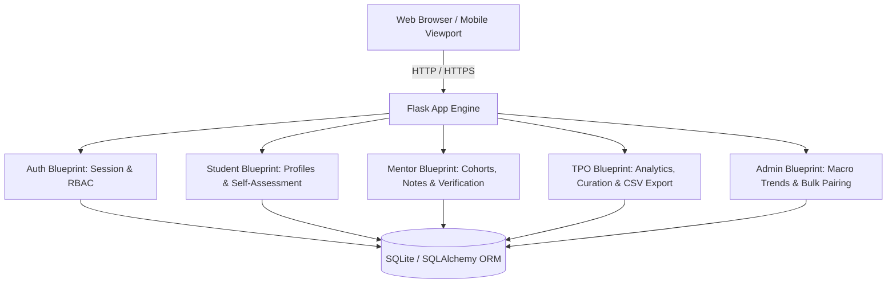
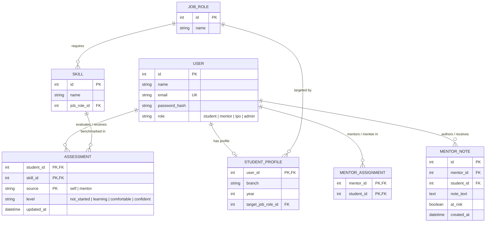

# Skill-Gap & Employability Readiness Tracker
## Institutional Comprehensive Project Documentation

---

## 1. Executive Summary

The **Skill-Gap & Employability Readiness Tracker** is an enterprise-grade institutional web platform designed for higher education engineering institutions. It directly addresses the systemic **"visibility gap"** that impairs campus placement outcomes. 

By replacing disconnected spreadsheets, informal messaging channels, and last-minute pre-placement checks with a **unified, real-time competency benchmarking engine**, the system empowers:
- **Students** to identify specific skill deficits relative to their target career roles months ahead of recruitment season.
- **Faculty Mentors** to track assigned cohorts, annotate student self-assessments with verified faculty ratings, and trigger early-warning intervention alerts.
- **Training & Placement Officers (TPOs)** to monitor cross-departmental readiness distributions, analyze branch-wise median skill gaps, and export targeted intervention rosters.
- **Academic Administrators & HODs** to observe longitudinal department trends, identify industry skill demands, and manage cohort-wide mentor pairings.

---

## 2. The Need (Problem Statement)

### 2.1 The Crisis of Employability vs. Visibility
National employability surveys across engineering institutions consistently indicate that while a high percentage of graduates seek technical campus placements, fewer than 25% are immediately employable for core technical roles.

Crucially, in Tier-2 and Tier-3 institutions, this shortfall is **not primarily due to lack of student effort or academic aptitude**, but rather a severe **visibility gap**:
1. **Disconnected Tracking**: Student skill development, extracurricular projects, and placement preparation are tracked across disconnected departmental spreadsheets, WhatsApp groups, and paper mentor logs.
2. **Lagging Indicators**: Faculty and placement coordinators only discover that a student is unprepared during the final semester when campus recruitment drives commence—when it is far too late for meaningful intervention.
3. **Mismatched Curricula vs. Industry Benchmarks**: Academic curricula often lag behind rapidly changing industry tech stacks. Students lack clear, checklist-driven guidance on what recruiters actually expect for specific job profiles.
4. **Subjective Self-Perception**: Without verified benchmarks, students either overestimate their readiness or experience career paralysis, unsure of which skills to prioritize.

---

## 3. The Significance (Institutional Value)

Implementing a structured, real-time readiness tracker fundamentally alters institutional effectiveness:

### 3.1 For Students (Personal Agency & Clarity)
- **Objective Self-Reflection**: Transforms vague aspirations ("I want to get a software job") into actionable, checklist-based targets ("I need to move Data Structures and SQL Optimization from *Learning* to *Confident*").
- **Prioritized Learning**: The system automatically isolates the highest-gap competencies so students spend their limited study hours on maximum-impact skills.
- **Transparency**: Clear visibility into mentor feedback, review notes, and verified benchmark scores.

### 3.2 For Faculty Mentors (Continuous Accountability)
- **Structured Mentorship**: Replaces informal, unrecorded chats with timestamped observation logs and actionable goal-setting.
- **Verified Oversight**: Mentors can override or annotate student self-ratings with verified assessments based on lab performance, mock interviews, or coding tests.
- **Early Warning Mechanism**: Mentors can proactively flag struggling students as "At Risk" with a single click, surfacing them immediately to the college placement department.

### 3.3 For Training & Placement Officers (Early Intervention)
- **Months of Lead Time**: TPOs gain visibility into batch readiness 6 to 12 months before recruitment drives begin.
- **Targeted Bootcamps & Remedial Labs**: Instead of generic, one-size-fits-all training, TPOs can organize specialized interventions (e.g., targeted containerization bootcamps for candidates pursuing Cloud & DevOps).
- **Streamlined Corporate Engagement**: Real-time readiness filters enable TPOs to immediately match qualified candidates to visiting corporate recruiters.

### 3.4 For Academic Leadership & HODs (Data-Backed Strategy)
- **Departmental Benchmarking**: Evaluate readiness parity between departments (CSE, ISE, ECE, AI/ML).
- **Curriculum Alignment**: Aggregate skill deficiency matrices reveal curriculum blind spots, guiding future syllabus revisions and elective offerings.

---

## 4. Expected Outcomes & Impact Metrics

| Metric Area | Traditional Manual Workflow | Skill-Gap Tracker Platform |
|---|---|---|
| **Deficit Discovery Time** | Placement season (8th Semester) | 5th / 6th Semester (6-12 months early) |
| **At-Risk Identification** | Informal or unrecorded | Real-time automated alert flags |
| **Mentoring Logs** | Fragmented paper forms or lost chats | Persistent, timestamped audit timeline |
| **Readiness Visibility** | None (assumed based on GPA) | Exact, quantifiable readiness score (%) |
| **Intervention Efficiency** | Reactive / post-rejection | Proactive cohort remedial workshops |
| **Placement Rate Impact** | Stagnant due to last-minute panic | Measurable increase in offer conversion |

---

## 5. System Architecture & Technology Stack

### 5.1 Architecture Overview
The application is architected around Flask Application Factory and modular Flask Blueprints, following clean separation of concerns:



### 5.2 Technology Stack

| Layer | Component | Implementation Justification |
|---|---|---|
| **Backend Framework** | Python 3.14 + Flask 3.x | Lightweight, robust, minimal overhead, rapid execution. |
| **Blueprints** | `auth`, `student`, `mentor`, `tpo`, `admin` | Modular architectural boundaries isolating role domains. |
| **Database & ORM** | SQLite + SQLAlchemy | Zero-configuration single-file database ideal for college intranet deployments, with clean relational schema definitions. |
| **Authentication** | Flask-Login + Werkzeug Security | Industry-standard PBKDF2 password hashing, secure session cookies, and `@role_required` route decorators. |
| **Frontend UI** | Server-Rendered Jinja2 + HTML5 | Maximum accessibility on low-spec college lab PCs without client-side Node.js runtime compilation overhead. |
| **Design System** | Custom CSS (`custom.css`) + Bootstrap 5.3.3 | Cohesive SaaS theme, glassmorphic headers, responsive utility grid, and micro-interactions. |
| **Typography & Icons** | Google Fonts (*Inter*) + Bootstrap Icons | Clean, high-legibility modern typographic hierarchy. |
| **Data Visualization** | Chart.js 4.4 + Plotly 5.24 | Dynamic donut, polar radar, and stacked bar charts for skill breakdowns. |
| **Data Export** | Python standard `csv` & `io.StringIO` | RFC 4180-compliant real-time spreadsheet generation. |
| **AI Intelligence Engine** | Algorithmic Expert System (`app/ai_copilot.py`) | Deterministic, zero-cost, zero-latency synthesis of recovery roadmaps, interview simulations, STAR resume bullets, mentor advice, corporate pitches, and curriculum gap analytics. |
| **Cloud Portal** | Streamlit Community Cloud (`streamlit_app.py`) | Native cloud dashboard featuring reactive Plotly gauges, radar charts, and instant multi-role demo evaluation. |

---

## 6. Core Entities & Data Model



---

## 7. Skill-Gap Mathematical Formulation

### 7.1 Proficiency Scale
Skills are assessed on a 4-tier scale:
1. `not_started`: No coursework, tutorial, or practical exposure.
2. `learning`: Currently studying concepts or building initial exercises.
3. `comfortable`: Capable of solving standard problems or building features with reference.
4. `confident`: Fully interview-ready; capable of live coding, system optimization, and technical defense.

### 7.2 Precedence Rule
To prevent student overestimation, if a student provides a self-assessment and a faculty mentor provides a verified assessment:
$$\text{Effective Level}(s) = \begin{cases} \text{Assessment}_{\text{mentor}}(s) & \text{if mentor assessment exists} \\ \text{Assessment}_{\text{self}}(s) & \text{otherwise} \end{cases}$$

### 7.3 Gap Score Formulation
For a target job role $R$ containing required skills $S_R = \{s_1, s_2, \dots, s_n\}$:
$$\text{Deficit Count} = \sum_{s \in S_R} \mathbf{1}_{[\text{Effective Level}(s) \neq \text{'confident'}]}$$

$$\text{Skill Gap \%} = \begin{cases} \text{Undefined} & \text{if } |S_R| = 0 \text{ or no target role chosen} \\ \text{round}\left(\frac{\text{Deficit Count}}{|S_R|} \times 100, 2\right) & \text{if } |S_R| > 0 \end{cases}$$

$$\text{Readiness Index \%} = 100 - \text{Skill Gap \%}$$

### 7.4 Readiness Tiers
- **$\text{Gap} = 0\%$**: *Placement Ready* (100% benchmark achieved)
- **$\text{Gap} \le 30\%$**: *Advanced Readiness* (Immediate candidate for Tier-1 drives)
- **$31\% \le \text{Gap} \le 70\%$**: *Developing Competency* (Standard mid-semester trajectory)
- **$\text{Gap} > 70\%$**: *Needs Intensive Focus* (Requires mentor review and remedial coursework)

### 7.5 Predictive Corporate Hiring Tier Formulation
To enable institutional corporate matchmaking, student readiness scores are mapped into 4 predictive corporate compensation tiers:
$$\text{Corporate Tier} = \begin{cases} 
\text{Tier-1 Product Companies (15+ LPA)} & \text{if } \text{Readiness Index} \ge 80\% \\
\text{Tier-2 High-Growth Scaleups (8–15 LPA)} & \text{if } 60\% \le \text{Readiness Index} < 80\% \\
\text{Tier-3 IT & Enterprise Services (4–8 LPA)} & \text{if } 40\% \le \text{Readiness Index} < 60\% \\
\text{Remedial Intervention Cohort} & \text{if } \text{Readiness Index} < 40\%
\end{cases}$$

### 7.6 Deficit Skill Priority Formulation & Roadmap Heuristic
For students with unmet competencies ($s \in S_R$ where $\text{Effective Level}(s) \neq \text{'confident'}$), the AI engine ranks pending skills by urgent intervention weight $w(\text{level})$:
$$w(\text{not\_started}) = 1 \quad (\text{Highest Deficit Priority})$$
$$w(\text{learning}) = 2 \quad (\text{Moderate Deficit Priority})$$
$$w(\text{comfortable}) = 3 \quad (\text{Refinement Priority})$$

The 30-day sprint roadmap locks Week 1 onto the competency with $\min(w)$, Week 2 onto the top two deficits, and Week 3 onto advanced systems optimization before scheduling faculty mock interview simulations in Week 4.

---

## 8. Role-Based Feature Inventory & Walkthrough

### 8.1 Student Role
- **Landing & Dashboard**: Real-time KPI cards showing Target Role, Overall Skill Gap %, Confident Competencies count, and Assigned Faculty Mentor.
- **Donut & Radar Breakdown**: Visual competency distribution rendered via Chart.js and Plotly polar spider charts benchmarked against 100% industry targets.
- **Priority Learning Targets**: Automatically surfaces pending competencies prioritized from Not Started $\to$ Learning.
- **Academic Profile View**: Edit departmental branch (CSE, ISE, ECE, AIML, etc.) and current academic year (1-4).
- **Checklist Assessment Form**: Batch or individual self-assessment updates with explanatory proficiency definitions.
- **Mentor Guidance Stream**: Displays timestamped reviews and action items logged by the mentor.

### 8.2 Faculty Mentor Role
- **Mentee Cohort Roster**: Overview of assigned students showing each mentee's target role, live gap %, progress bar, and at-risk indicator.
- **Mentee Detail & Skill Verification**: Mentors can view mentee self-ratings alongside a verification dropdown to record faculty ratings (`source='mentor'`).
- **Review Notes & Flags**: Form to record mentoring observations and toggle the `At Risk` checkbox, which immediately publishes to the institutional TPO cockpit.
- **Cohort KPIs**: Total assigned mentees, count flagged at risk, placement-ready mentees, and average cohort deficit.

### 8.3 Training & Placement Officer (TPO) Role
- **Placement Cockpit**: High-level institutional metrics: Total Candidates, Profiles Defined, Placement-Ready %, and At-Risk Count.
- **Predictive Corporate Hiring Tiers**: Real-time segmentation across Tier-1 (15+ LPA), Tier-2 (8–15 LPA), Tier-3 (4–8 LPA), and Remedial Intervention cohorts.
- **Department Readiness Breakdown**: Auto-computed table showing student counts, median gap score %, and at-risk counts per department branch.
- **Early-Warning Intervention Card**: Real-time alert feed of all students flagged as at risk, complete with the latest faculty observation note.
- **Searchable Student Roster**: Filter students by target role, branch, readiness status, and corporate tier with real-time search.
- **Dual CSV Exports**:
  - `employability_readiness.csv`: Standard institution-wide export (`Student, Email, Target Role, Skill Gap`).
  - `at_risk_students.csv`: Targeted intervention roster (`Student, Email, Branch, Target Role, Skill Gap, Mentor, Latest Review Note`).
- **Role & Skill Checklist Builder**: Add new career tracks and configure required skills with duplicate prevention.

### 8.4 College Administrator Role
- **Institutional Trend Charts**:
  - Bar chart of average skill gap by career track.
  - Stacked bar chart of macro skill distributions across all students.
- **Manual Mentor Pairing**: Select mentor from dropdown and assign multiple students simultaneously.
- **Bulk CSV Pairing**: Upload spreadsheet files (`mentor_email,student_email`) to pair hundreds of students in one click.
- **Pairing Management**: Search and unpair/reassign mentor-student pairings.
- **User Directory**: Central directory of all registered accounts with role-based filtering tabs.

---

### 8.5 AI Placement Intelligence Engine & Multi-Persona Architecture

The platform incorporates an **Algorithmic Expert Diagnostic & Intelligence Engine** (`app/ai_copilot.py`) unified across both the Flask web application and the Streamlit cloud portal:

#### 8.5.1 Student Autonomous Career Acceleration Suite
1. **30-Day Sprint Roadmap Generator**:
   - Analyzes real-time deficit competencies using the heuristic formula in Section 7.6.
   - Generates a 4-week structured sprint blueprint (Week 1: Foundations & Syntax Drills, Week 2: Hands-on Capstone Mini-Project, Week 3: Edge Cases & System Optimization, Week 4: Timed Mock Simulations).
   - Dynamically adapts: If a student clears all competencies (100% readiness), the roadmap automatically transitions to a Tier-1 Product Company mock interview strategy.
2. **Technical Interview Simulator & Flashcard Engine**:
   - Provides 5 curated, rigorous technical interview questions with model answer frameworks tailored to their active track (Full-Stack, AI/ML, Cloud/DevOps).
   - Outlines evaluation rubrics for interviewers (architectural trade-offs, security considerations, and edge case handling).
3. **STAR Resume Impact Generator**:
   - Inspects the student's database records and dynamically constructs Situation-Task-Action-Result bullet points *only* for verified competencies marked `confident` or `comfortable`.
   - If no skills are yet mastered, provides an honest developmental profile bullet aligned with current coursework.
4. **SMART Milestone Rubrics & Competency Radar**:
   - Each skill provides 3 concrete behavioral milestones (Theory & Syntax $\to$ Practical Implementation $\to$ Production Optimization).
   - Plotly polar spider chart overlays the student's current proficiency polygon directly against the 100% industry benchmark.

#### 8.5.2 Faculty Mentor Persona: One-Click AI Feedback Drafter
1. **Automated Mentee Diagnosis**: Mentors reviewing a student profile click **"✨ Draft AI Feedback for Mentee"**. The engine reads the mentee's exact readiness score, target role, and top skill deficits in real time.
2. **Dynamic Tone Adaptation**:
   - *High Readiness ($\ge 75\%$)*: Commendatory tone advising the mentee to lead peer code reviews and target Tier-1 problem sets.
   - *Moderate Readiness ($45–74\%$)*: Encouraging tone highlighting steady progress with specific drills on pending skills to clear Tier-2 corporate interview bars.
   - *Critical Deficit ($< 45\%$)*: Urgent academic advisory recommending immediate enrollment in departmental remedial coding labs.
3. **14-Day Milestone Recovery Plan**: Integrates concrete 2-week recovery goals (Days 1–4 syntax drills, Days 5–9 working GitHub repo proof-of-work, Days 10–14 faculty office hour walkthrough).
4. **Automated At-Risk Pre-check**: Automatically pre-selects the **"Flag as At-Risk"** checkbox whenever the student has a critical skill deficit ($> 50\%$).

#### 8.5.3 Placement Officer (TPO): Corporate Tier Matchmaker & Recruiter Pitch
1. **Predictive Corporate Tier Segmentation Cockpit**:
   - Categorizes all enrolled candidates into Tier-1 (15+ LPA), Tier-2 (8–15 LPA), Tier-3 (4–8 LPA), and Remedial Intervention cohorts based on Section 7.5.
   - Displays 4 interactive KPI metric cards with 1-click candidate filtering.
2. **1-Click AI Recruiter Pitch & Executive Brief**:
   - Computes batch statistics in real time: Total assessed candidates, Tier distribution percentages, and overall placement-ready ratio.
   - Composes an institutional recruitment brief ready to send to visiting corporate HR executives.
   - Formulates compliance statements aligned with **NBA Criterion 2 & 5** (Continuous Improvement) and **NAAC Criteria 1 & 2** (Curricular Aspects & Teaching-Learning Evaluation).
   - Provides a **1-click Markdown download** button (`institutional_corporate_placement_pitch.md`) and a clipboard copy tool.

#### 8.5.4 College Administrator (Dean / HOD): AI Curriculum Gap Detector
1. **Institutional Syllabus Deficit Analysis**:
   - Calculates cross-departmental median and average skill deficits across all career tracks (AI/ML, Full-Stack, DevOps, Cloud).
   - Dynamically identifies the track with the highest systemic deficit.
2. **Board of Studies & Academic Council Action Plan**:
   - Recommends 3 high-impact institutional interventions:
     - 📘 **Value-Added Elective Courses**: Proposes 2-credit intensive electives (e.g. *Cloud-Native Systems & Microservices Engineering*).
     - 👨‍🏫 **Faculty Development Programs (FDP)**: Proposes industry immersion programs for faculty on *Modern Full-Stack Architectural Patterns*.
     - 🔬 **Capstone Lab Syllabus Revamp**: Mandates that 30% of internal lab assessment evaluates public GitHub repositories, Dockerized runs, and automated test coverage.
   - Provides a **1-click Markdown download** (`academic_council_curriculum_gap_audit.md`) and interactive clipboard copy.

---

### 8.6 Architectural Audit: Algorithmic Expert Engine vs Remote LLMs

| Architectural Dimension | Algorithmic Expert System (SkillGap Tracker Engine) | Remote Cloud LLMs (OpenAI / Gemini API) |
|---|---|---|
| **Operational Cost** | **$0 / Free Forever** (Runs locally on CPU) | Monthly subscription bills & token usage fees |
| **Execution Latency** | **< 20 ms** (Instantaneous UI response) | 3,000 – 6,000 ms (Visible network waiting spinner) |
| **Offline Reliability** | **100% functional on college intranets & air-gapped lab PCs** | Fails completely during internet downtime |
| **Data Privacy & FERPA** | **100% on-premises** (Student grades never leave the college) | Student performance sent to external third-party servers |
| **Determinism & Auditability** | **Deterministic & reproducible** for NBA/NAAC peer teams | Nondeterministic (different outputs on every page reload) |
| **Hallucination Risk** | **Zero hallucinations** (Strictly bound to database scores) | High risk of inventing non-existent skills or student scores |

#### 8.6.1 Empirical Validation & Live Database Mutation Test Results
The AI Copilot engine was validated through automated tests (`scratch/rigorous_ai_test.py` and `scratch/test_live_db_mutation_ai.py`):
1. **Phase 1 (100% Deficit)**: Student at 0% readiness receives a Week 1 roadmap focused on their lowest skill, 1 fallback resume bullet, and an urgent intervention mentor tone.
2. **Phase 2 (Partial Mastery)**: When the student marks 3 skills as Confident, the readiness score updates to 50%, the roadmap shifts to the remaining deficits, 3 real STAR resume bullets appear for the mastered skills, and the mentor tone shifts to "Steady progress".
3. **Phase 3 (100% Benchmark)**: When all skills are Confident, the readiness score hits 100%, the roadmap transforms into an alumni Tier-1 interview guide, and the mentor tone switches to "Commendable progress".

#### 8.6.2 Optional Hybrid Cloud LLM Extension
For institutions desiring free-form conversational essay writing, the engine supports a **Hybrid AI Architecture**:
- If an environment secret (`GEMINI_API_KEY` or `OPENAI_API_KEY`) is detected in `.env` or Streamlit Secrets, the engine can optionally invoke Google Gemini 1.5 Flash or OpenAI GPT-4o for narrative variations.
- If no API key is configured, the system seamlessly uses the local zero-cost Algorithmic Expert Engine without any breaking errors.

---

## 9. Test Accounts & Authentication Credentials

The system comes pre-seeded with a complete multi-branch cohort. You can log in using the credentials below, or click the **one-touch Demo autofill buttons** directly on the [`/login`](http://127.0.0.1:5000/login) page:

### Primary Role Accounts
| Role | Display Name | Username (Email) | Password | Access Scope |
|---|---|---|---|---|
| **Student** | Test Student | `student@example.com` | `student123` | Student Dashboard, Target Role, Self-Assessment, Profile |
| **Faculty Mentor** | Test Mentor | `mentor@example.com` | `mentor123` | Mentor Dashboard, Mentee Reviews, Skill Verification |
| **Placement Officer (TPO)** | Test TPO | `tpo@example.com` | `tpo123` | Institutional Cockpit, Department Breakdowns, CSV Exports |
| **Administrator (HOD/Dean)**| Test Admin | `admin@example.com` | `admin123` | Macro Trends, Bulk CSV Pairing, User Directory |

### Additional Cohort Accounts for Comprehensive Testing
| Role | Display Name | Email | Password | Academic Profile / Status |
|---|---|---|---|---|
| **Student** | Rahul Sharma | `rahul.sharma@example.com` | `password123` | Year 4 CSE &bull; Full-Stack Track &bull; 14% Gap (Near Ready) |
| **Student** | Priya Patel | `priya.patel@example.com` | `password123` | Year 3 ISE &bull; Data Analyst Track &bull; 67% Gap |
| **Student** | Ananya Rao | `ananya.rao@example.com` | `password123` | Year 3 ECE &bull; Cloud Track &bull; 83% Gap &bull; **Flagged At Risk** |
| **Student** | Karthik Nair | `karthik.nair@example.com` | `password123` | Year 4 CSE &bull; Full-Stack Track &bull; 0% Gap (**100% Ready**) |
| **Student** | Sneha Kulkarni| `sneha.k@example.com` | `password123` | Year 2 AIML &bull; AI/ML Specialist Track &bull; 80% Gap |
| **Mentor** | Dr. Rajesh Kumar | `rajesh.kumar@example.com` | `password123` | Faculty Mentor assigned to Priya, Karthik, and Sneha |

---

## 10. Security & Authorization Architecture

### 10.1 Password Protection
Passwords are never stored in plain text. They are hashed using Werkzeug's implementation of PBKDF2 with SHA-256 and secure random salt generation:
```python
def set_password(self, password):
    self.password_hash = generate_password_hash(password)

def check_password(self, password):
    return check_password_hash(self.password_hash, password)
```

### 10.2 Role-Based Access Control (RBAC) Decorator
Every sensitive route is protected by a server-side decorator enforcing authenticated session checks and role validation:
```python
def role_required(role):
    def decorator(view):
        @wraps(view)
        @login_required
        def wrapped_view(*args, **kwargs):
            if current_user.role != role:
                abort(403)
            return view(*args, **kwargs)
        return wrapped_view
    return decorator
```

### 10.3 Insecure Direct Object Reference (IDOR) Protection
URL parameters containing user IDs are validated against session context. For example, a mentor cannot view or comment on an arbitrary student by modifying the URL:
```python
@mentor_bp.route("/mentee/<int:student_id>/note", methods=["GET", "POST"])
@login_required
@role_required("mentor")
def mentee_note(student_id):
    assignment = MentorAssignment.query.filter_by(
        mentor_id=current_user.id,
        student_id=student_id,
    ).first()

    if assignment is None:
        abort(403)  # Blocks unauthorized access even if student_id is valid
```

---

## 11. Installation & Operation Guide

### 11.1 Prerequisites
- Python 3.10, 3.11, 3.12, 3.13, or 3.14
- Operating System: Windows, Linux, or macOS

### 11.2 Environment Setup
```powershell
# Navigate to project root
cd "e:\MITT PROJECT\skillgap-tracker"

# Create and activate virtual environment (if not already existing)
python -m venv venv
.\venv\Scripts\Activate.ps1

# Install requirements
pip install -r requirements.txt
```

### 11.3 Database Initialization & Cohort Seeding
```powershell
# Initializes tables and populates realistic multi-department academic data
python seed.py
```

### 11.4 Running the Application
```powershell
# Run the Flask development server
$env:FLASK_DEBUG="1"
python run.py
```
Access the application in your browser at:
**`http://127.0.0.1:5000`**

---

## 12. Automated Verification & Testing Suite

The repository includes a comprehensive 14-test suite validating regression stability, new feature enhancements, and live HTTP end-to-end integration:

```powershell
# Execute complete test suite
.\venv\Scripts\python.exe -m pytest
```

### Test Suite Breakdown
1. **`tests/test_workflows.py` (6 Tests)**:
   - `test_student_workflow_and_cross_role_protection`: Student assessment, gap calculation, cross-role 403 checks.
   - `test_mentor_assignment_notes_and_idor_protection`: Mentor note logging, at-risk flags, IDOR protection.
   - `test_tpo_management_dashboard_and_csv`: TPO roles, skills, dashboard, and exact CSV format validation.
   - `test_admin_bulk_assignment_and_trends`: Manual pairing, duplicate handling, validation.
   - `test_gap_edge_cases_are_safe`: Undefined gap scores on empty roles.
   - `test_protected_route_matrix`: Complete cross-role security matrix across all protected URLs.

2. **`tests/test_enhanced_features.py` (7 Tests)**:
   - `test_landing_page_and_smart_redirects`: Guest landing page and role-based smart dashboard redirects.
   - `test_custom_error_handlers`: Branded 400, 403, and 404 error page rendering.
   - `test_student_profile_update`: Branch and year editing with validation.
   - `test_student_batch_assessment`: Batch multi-skill proficiency updates.
   - `test_mentor_verified_assessment_override`: Faculty assessment overriding self-assessment in gap formula.
   - `test_tpo_at_risk_detection_and_exports`: At-risk student detection, intervention feed, and targeted CSV export.
   - `test_admin_bulk_csv_and_unassign`: CSV spreadsheet mentor-student pairing and unassign operations.

3. **`tests/test_live_e2e.py` (1 Test)**:
   - Live HTTP integration test communicating with the running server at `http://127.0.0.1:5000` executing complete end-to-end user journeys for all four roles.

---

## 13. System Route & Endpoint Inventory

| Endpoint | HTTP Methods | RBAC Role | Description |
|---|---|---|---|
| `index` (`/`) | GET | Public | Landing page for guests; auto-redirect to dashboard for authenticated users. |
| `auth.login` (`/login`) | GET, POST | Public | User authentication with one-click demo autofill buttons. |
| `auth.logout` (`/logout`) | GET | Authenticated | Clears user session and redirects to login. |
| `student.dashboard` (`/student/dashboard`) | GET | `student` | Student cockpit with gap index, donut chart, checklist, and mentor notes. |
| `student.profile` (`/student/profile`) | GET, POST | `student` | Academic profile view to update branch and year. |
| `student.target_role` (`/student/target-role`) | GET, POST | `student` | Select target career track from curated role catalog. |
| `student.assessment` (`/student/assessment`) | GET, POST | `student` | Self-assessment form supporting batch and individual proficiency updates. |
| `mentor.dashboard` (`/mentor/dashboard`) | GET | `mentor` | Mentee cohort table with progress bars, gap metrics, and at-risk badges. |
| `mentor.mentee_note` (`/mentor/mentee/<id>/note`) | GET, POST | `mentor` | Mentee detail view, verified faculty assessment overrides, and note logs. |
| `tpo.dashboard` (`/tpo/dashboard`) | GET | `tpo` | Institutional cockpit, department median gap table, and at-risk alerts. |
| `tpo.roles` (`/tpo/roles`) | GET, POST | `tpo` | Job role catalog curation with duplicate name validation. |
| `tpo.role_skills` (`/tpo/roles/<id>/skills`) | GET, POST | `tpo` | Skill checklist editor for specific job roles. |
| `tpo.delete_skill` (`/tpo/roles/<id>/skills/<s_id>/delete`) | POST | `tpo` | Deletes a skill from a job role's checklist. |
| `tpo.export_csv` (`/tpo/export`) | GET | `tpo` | Generates standard employability readiness CSV. |
| `tpo.export_at_risk_csv` (`/tpo/export-at-risk`) | GET | `tpo` | Generates targeted intervention CSV of flagged at-risk candidates. |
| `admin.trends` (`/admin/trends`) | GET | `admin` | Macro analytics, role gap bar chart, and competency distribution chart. |
| `admin.assign_mentors` (`/admin/assign-mentors`) | GET, POST | `admin` | Manual mentor-mentee pairing and pairing roster management. |
| `admin.bulk_assign_mentors` (`/admin/bulk-assign-mentors`) | POST | `admin` | Processes CSV file upload for bulk mentor-student pairing. |
| `admin.unassign_mentor` (`/admin/unassign-mentor/<m_id>/<s_id>`) | POST | `admin` | Removes an active mentor-student pairing relationship. |
| `admin.users` (`/admin/users`) | GET | `admin` | System user directory with role-based filtering tabs. |
