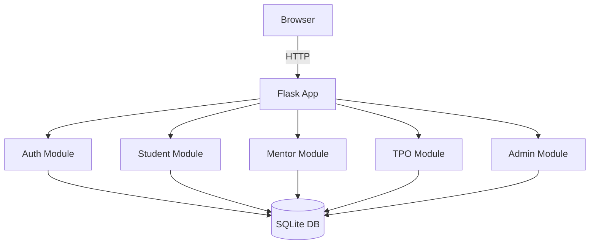

# Implementation Plan: Skill-Gap & Employability Readiness Tracker

This plan translates spec.md into concrete technical decisions. It is
deliberately kept simple: you're implementing with a 7B local model,
task-by-task, so the architecture avoids anything that needs a lot of
cross-file context or exotic tooling.

## 1. Tech Stack

| Layer | Choice | Why |
|---|---|---|
| Backend | Python + Flask | Small, simple, minimal boilerplate — easy for a 7B model to generate correctly one route at a time |
| Database | SQLite | Zero setup, single file, fine for a college-scale dataset (hundreds to low thousands of students) |
| ORM | SQLAlchemy | Keeps schema changes and queries explicit and easy to review, rather than hand-written SQL scattered everywhere |
| Frontend | Server-rendered HTML with Jinja2 templates + Bootstrap | No build step, no JS framework complexity, works on low-spec lab computers, easy for the model to generate in isolated chunks |
| Auth | Flask-Login + password hashing (werkzeug) | Standard, well-documented, small surface area |
| Data export | Python `csv` module | Built-in, no extra dependency for the TPO's CSV export feature |

**Explicitly avoided for v1:** React/Vue/any SPA framework, microservices,
Docker orchestration, cloud-managed databases. These add real value at scale
but add complexity that fights against small-model, task-by-task generation.
You can migrate later once the core is working.

## 2. Architecture Overview



A single Flask app, organized into blueprints (one per role/module), all
reading and writing to one SQLite database through SQLAlchemy models.

## 3. Directory Structure

```
skillgap-tracker/
├── app/
│   ├── __init__.py          # Flask app factory
│   ├── models.py            # SQLAlchemy models (User, Skill, JobRole, Assessment, MentorNote)
│   ├── auth/
│   │   ├── routes.py
│   │   └── templates/
│   ├── student/
│   │   ├── routes.py
│   │   └── templates/
│   ├── mentor/
│   │   ├── routes.py
│   │   └── templates/
│   ├── tpo/
│   │   ├── routes.py
│   │   └── templates/
│   ├── admin/
│   │   ├── routes.py
│   │   └── templates/
│   └── static/
│       └── style.css
├── tests/
│   └── test_*.py
├── config.py
├── requirements.txt
└── run.py
```

This structure matters for your workflow: each module (auth, student,
mentor, tpo, admin) is a natural task boundary. You can hand the model one
module's routes.py at a time without it needing to see the whole codebase.

## 4. Data Model (core entities)

- **User**: id, name, email, password_hash, role (`student`/`mentor`/`tpo`/`admin`)
- **JobRole**: id, name (e.g., "Backend Developer")
- **Skill**: id, name, job_role_id (which role this skill belongs to)
- **StudentProfile**: user_id, branch, year, target_job_role_id
- **Assessment**: student_id, skill_id, level (enum: not_started/learning/comfortable/confident), source (self/mentor), updated_at
- **MentorAssignment**: mentor_id, student_id
- **MentorNote**: mentor_id, student_id, note_text, created_at, at_risk (bool)

## 5. Non-Functional Constraints (from spec.md, made concrete)

- **Performance:** page loads under 1s on a lab computer for typical
  dataset sizes (a few thousand rows) — SQLite + indexed queries is enough.
- **Security:** passwords hashed (never plaintext), role checks on every
  route via a decorator, no student can query another student's data via
  URL manipulation (enforce via server-side ownership checks, not just UI hiding).
- **Accessibility:** use semantic HTML and Bootstrap's built-in accessible
  components rather than custom widgets.

## 6. Local-Model Working Notes (specific to your setup)

- Generate one blueprint's routes.py at a time, not the whole app in one shot.
- After each task, run the Flask dev server and manually click through the
  new feature before starting the next task — don't chain unverified tasks.
- If a task involves a cross-cutting concern (e.g., "add role-based access
  control to all routes"), consider doing that one manually or with a cloud
  model (per your earlier hybrid setup) — multi-file consistency is exactly
  where a 7B model is weakest.
- Keep each generation prompt scoped to a single file or a single function
  where possible.
